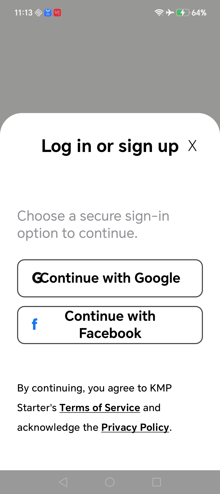
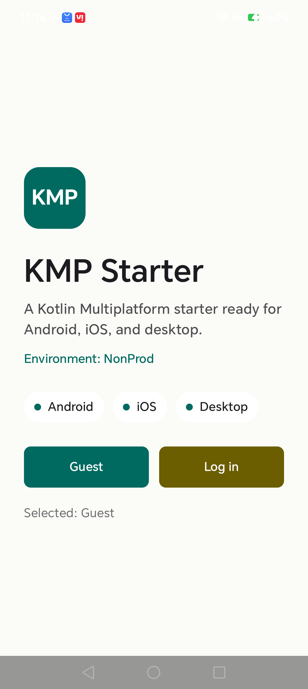
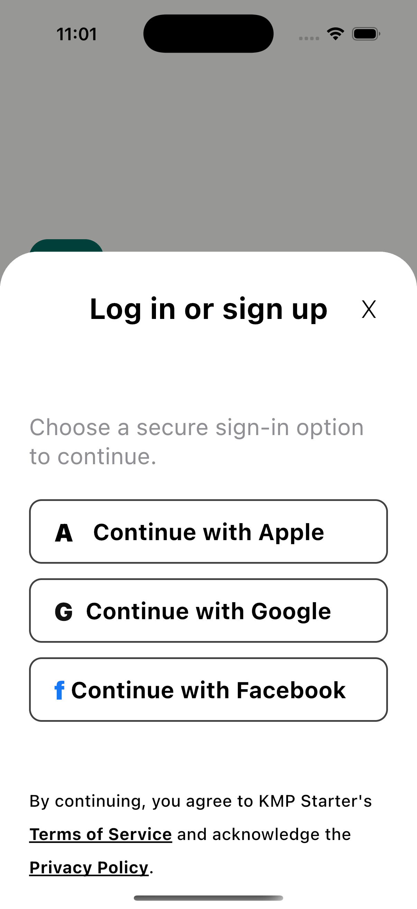
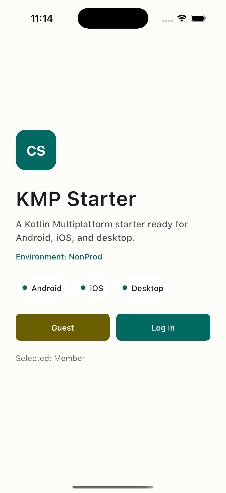
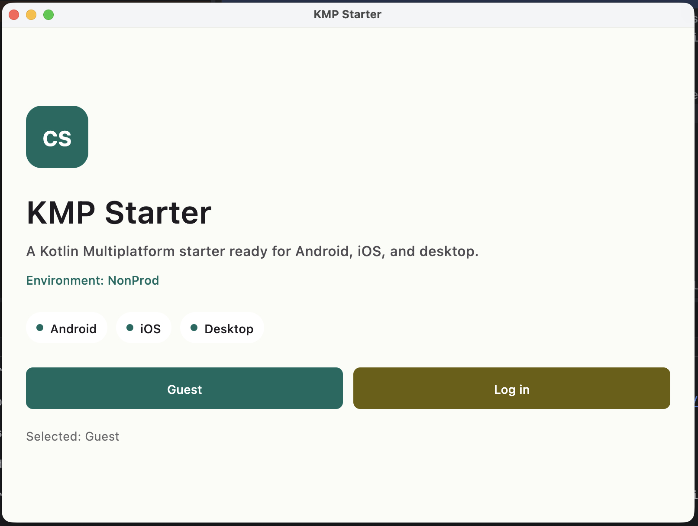
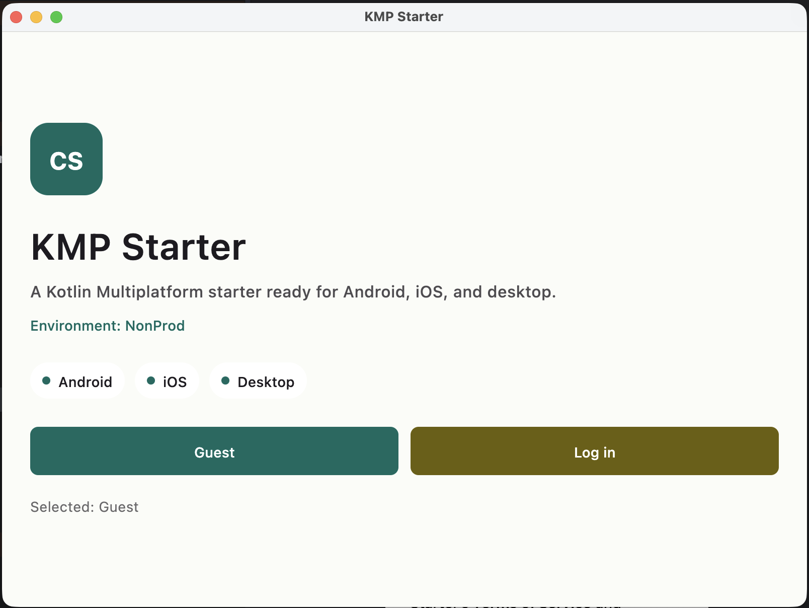

# KMP Starter

KMP Starter is a Kotlin Multiplatform starter project with Android and iOS applications sharing the same Compose UI foundation, runtime environment model, and product-facing app surface.

The repository is structured so product work starts in shared KMP by default. Android and iOS modules should stay thin: they launch the app, provide platform services, and adapt build settings into shared code.

## Screenshots

The starter renders the same shared Compose Multiplatform app surface across Android, iOS, and desktop. The login sheet is shared UI, while platform source sets decide which sign-in providers are available.

| Platform | Login | Home |
| --- | --- | --- |
| Android |  |  |
| iOS |  |  |
| Desktop |  |  |

## Product Shape

- Product: `KMP Starter`
- Android package: `com.kmpstarter.android`
- iOS wrapper: `iosApp/KmpStarter.xcodeproj`
- Shared app surface: `shared:app`
- Primary environments: `nonProd`, `prod`
- UI technology: Compose Multiplatform
- Android platform stack: Hilt, Room, Retrofit/OpenAPI, WorkManager, DataStore
- Shared runtime config: `KmpStarterRuntimeConfig` in `shared:app`

## KMP First Rule

New product UI, screen state, UI events, environment IDs, default URLs, and product-facing behavior belong in shared KMP unless they require a platform API.

Platform code is allowed for:

- app launch and lifecycle glue
- dependency injection entry points
- platform permissions, files, notifications, deep links, and system UI
- Android-only persistence/network implementation while those layers are being migrated
- Xcode/Gradle build setting adaptation

Do not create Android-only or iOS-only product UI when a shared Compose implementation can work.

## Repository Map

```text
app                         Android launcher and Android app wiring
iosApp                      Xcode iOS wrapper around the shared KMP framework
desktopApp                  Desktop launcher for local shared UI validation
shared/app                  Shared Compose app, runtime config, iOS UIViewController entry point
core/*                      Android core infrastructure and models
feature/*                   Android feature domain/data/ui modules during KMP migration
build-logic                 Gradle convention plugins
docs                        Engineering and architecture standards
```

## Environments

Shared KMP owns the environment model:

- `KmpStarterEnvironment.NonProd`
- `KmpStarterEnvironment.Prod`
- `KmpStarterRuntimeConfig`

Android flavors adapt into shared config:

- `nonProd` -> `BuildConfig.ENVIRONMENT=nonProd`
- `prod` -> `BuildConfig.ENVIRONMENT=prod`

iOS build settings adapt into shared config:

- `Debug` -> `KMP_STARTER_ENVIRONMENT=nonProd`
- `Release` -> `KMP_STARTER_ENVIRONMENT=prod`

Default URLs live in shared KMP. Android can override URLs through Gradle properties, environment variables, or untracked `local.properties`:

```properties
NON_PROD_API_BASE_URL=https://api.nonprod.example.com/
PROD_API_BASE_URL=https://api.example.com/
```

iOS can override `KMP_STARTER_API_BASE_URL` in Xcode build settings when needed.

## Run

Android non-prod:

```bash
./gradlew :app:assembleNonProdDebug
```

Desktop shared UI:

```bash
./gradlew :desktopApp:run
```

iOS non-prod simulator:

```bash
./gradlew :shared:app:linkDebugFrameworkIosSimulatorArm64
open iosApp/KmpStarter.xcodeproj
```

In Xcode, run the `KmpStarter` scheme with `Run > Build Configuration = Debug`.

iOS prod uses the Xcode `Release` build configuration. The current wrapper links the debug simulator framework by default; add release/device framework wiring before treating Release as a full production archive path.

## JDK Setup

Android builds require Gradle to run on a full JDK 21. Some IDE extensions bundle a smaller JRE that does not include `jlink`, which can fail Android tasks with `androidJdkImage` errors.

Check your Gradle JVM:

```bash
./gradlew --version
```

If it points at an IDE-bundled JRE, set `JAVA_HOME` to a full JDK 21 before running Gradle:

```bash
export JAVA_HOME=$(/usr/libexec/java_home -v 21)
./gradlew :app:assembleNonProdDebug
```

In VS Code, set the Java extension's Gradle JVM to a full JDK 21 installation. The path must contain `bin/jlink`.

## Verification

Run the smallest relevant check first, then broaden:

```bash
./gradlew spotlessCheck
./gradlew detekt ktlintCheck
./gradlew test
./gradlew lint
./gradlew :app:assembleNonProdDebug
./gradlew :shared:app:linkDebugFrameworkIosSimulatorArm64
```

OpenAPI generation:

```bash
./gradlew :core:network:openApiGenerate
```

Git hooks:

```bash
git config core.hooksPath .githooks
```

## Standards

- [Engineering guide](docs/development/engineering-guide.md): product engineering rules and KMP boundaries
- [Architecture notes](docs/architecture/README.md): module graph and platform ownership
- [Agent guide](AGENTS.md): strict rules for AI agents and automation
- [Contributing](CONTRIBUTING.md): setup and pull request checklist

Generated OpenAPI code under `core/network/build/generated/openapi` is disposable and must never be edited manually.

Secrets, tokens, keystores, signing passwords, and machine-specific paths must stay out of Git.
