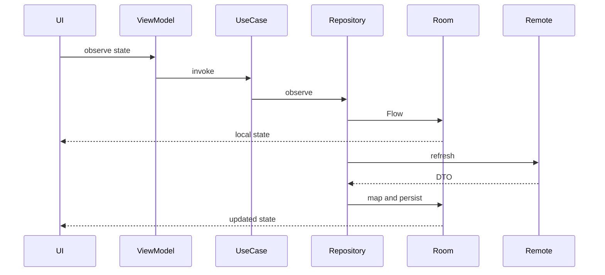

# KMP Starter Product Architecture

KMP Starter is a Kotlin Multiplatform starter project with Android and iOS applications. The architecture is designed so product UI and runtime behavior are shared first, while platform modules provide launch, build, and platform service integration.

For day-to-day engineering rules, see [../development/engineering-guide.md](../development/engineering-guide.md).

## Product Runtime

```text
Android app ─┐
             ├─ shared:app ── shared Compose UI and runtime config
iOS app ─────┘

desktopApp ─── shared:app
```

The Android and iOS apps should behave like the same product on different platforms. They should not grow separate copies of product screens or environment logic.

## Module Graph

```text
app
├── shared:app
├── feature:*:ui
├── feature:*:data
└── core:*

iosApp
└── KmpStarterShared.framework from shared:app

desktopApp
└── shared:app

shared:app
└── common Compose/runtime code

feature:*:ui -> feature:*:domain
feature:*:data -> feature:*:domain
feature:*:domain -> core:model/core:common
```

`shared:app` owns the shared app surface. Android feature UI modules currently host Android route glue and Hilt ViewModels while the rest of the product migrates to shared KMP. Generated OpenAPI clients live in `core:network`.

## Platform Entry Points

Android:

```text
app/src/main/java/com/kmpstarter/android/MainActivity.kt
```

Android calls `KmpStarterApp(runtimeConfig = ...)` from shared KMP.

iOS:

```text
iosApp/KmpStarter.xcodeproj
shared/app/src/iosMain/kotlin/com/kmpstarter/shared/app/MainViewController.kt
```

The Swift launcher reads environment values from `Info.plist`, passes them to `MainViewController(...)`, and renders shared Compose through `ComposeUIViewController`.

Desktop:

```text
desktopApp/src/main/kotlin/com/kmpstarter/desktop/Main.kt
```

Desktop renders the same shared `KmpStarterApp` for fast shared UI validation.

## Runtime Environment

Environment ownership is shared:

```text
shared/app/src/commonMain/.../KmpStarterRuntimeConfig.kt
```

Shared KMP owns:

- environment IDs
- display names
- default API base URLs
- runtime config creation

Platform mapping:

```text
Android nonProd flavor -> nonProd
Android prod flavor    -> prod
iOS Debug              -> nonProd
iOS Release            -> prod
```

New environments must be added in shared KMP first, then bound in Gradle and Xcode.

## KMP Boundary

Shared `commonMain` may contain:

- Compose Multiplatform UI
- product screen state
- UI events
- product runtime config
- plain Kotlin models and rules
- small platform-neutral interfaces

Shared `commonMain` may not contain:

- Android `Context`
- Hilt
- Room
- WorkManager
- AndroidX lifecycle/navigation
- Android resources
- Retrofit JVM implementation details
- generated OpenAPI classes
- iOS UIKit/Swift types

Use platform source sets or platform launcher modules for these concerns.

## Offline-First Data

Room is the source of truth while persistence is Android-owned.



Remote responses do not directly drive persistent UI. They are mapped into local storage first.

## OpenAPI

`core:network` generates Kotlin Retrofit sources under:

```text
core/network/build/generated/openapi
```

Generated sources are disposable. Do not edit them manually. Wrap generated APIs in handwritten data sources and map responses into entities/domain models.

## iOS Framework Wiring

The iOS wrapper links `KmpStarterShared.framework` produced by `shared:app`.

Simulator debug framework:

```bash
./gradlew :shared:app:linkDebugFrameworkIosSimulatorArm64
```

Current wrapper path:

```text
shared/app/build/bin/iosSimulatorArm64/debugFramework
```

`KmpStarterShared.framework` is static. Link it; do not add it to an Embed Frameworks phase.

## Architecture Guardrails

- Product UI starts in shared Compose.
- Platform modules adapt, they do not reimplement product behavior.
- Shared runtime config is the single source for environment identity.
- Domain does not depend on data, UI, app, generated clients, or platform frameworks.
- Generated code is not source-of-truth.
- Secrets and machine-local values stay outside Git.

## Decisions Requiring ADRs

Use `docs/architecture/adr-template.md` for changes to:

- KMP module ownership
- navigation architecture
- shared persistence strategy
- DI strategy
- environment strategy
- generated client strategy
- offline-first data ownership
